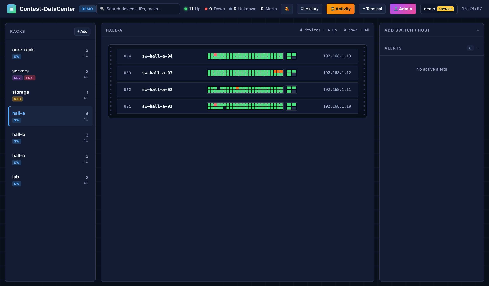
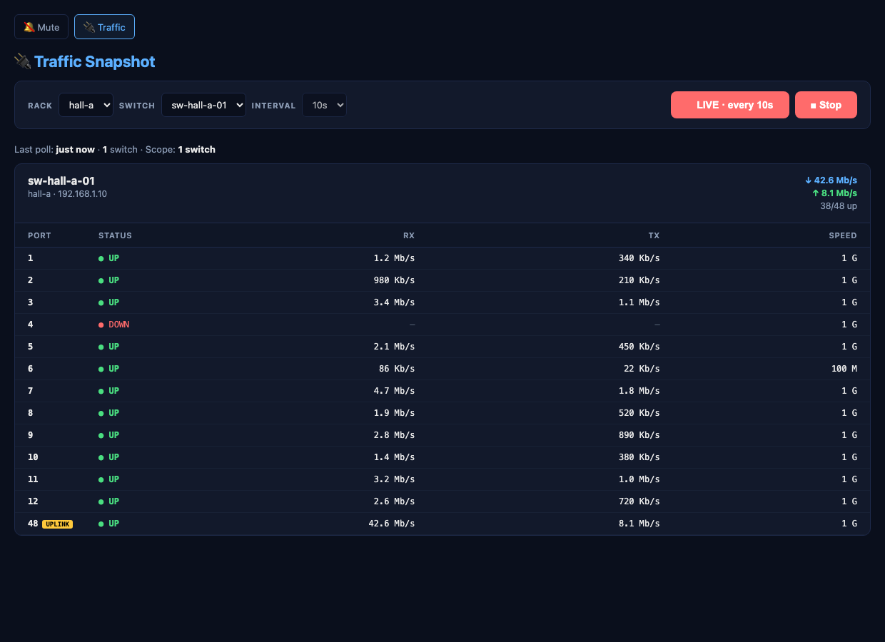
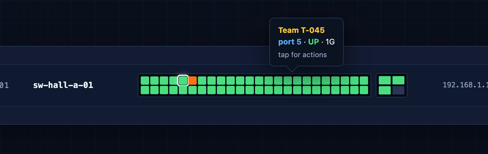
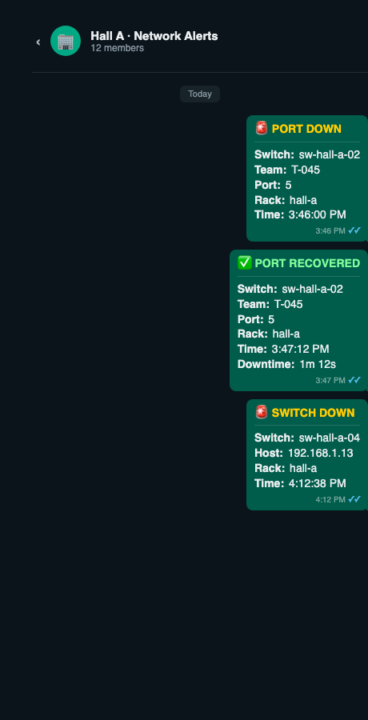
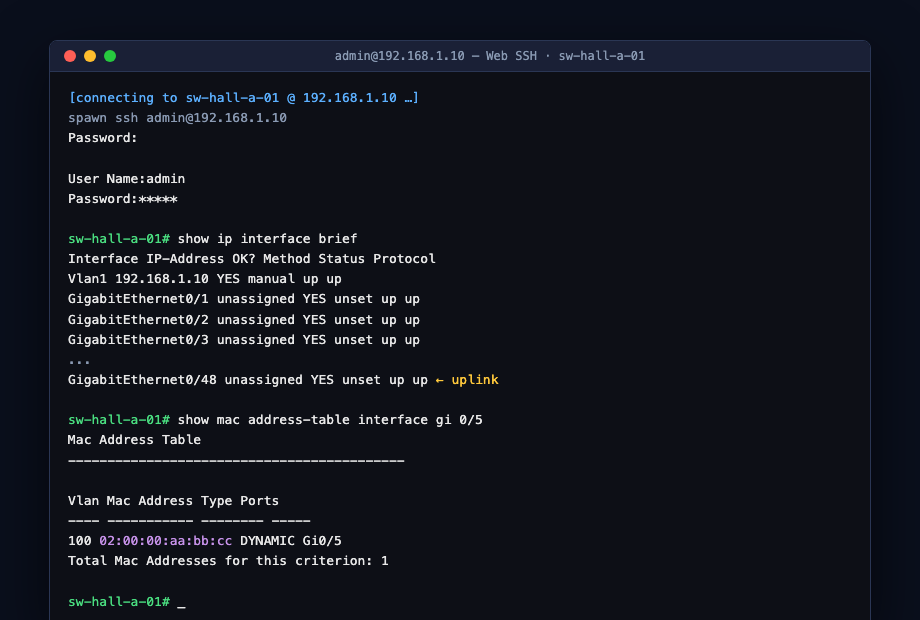
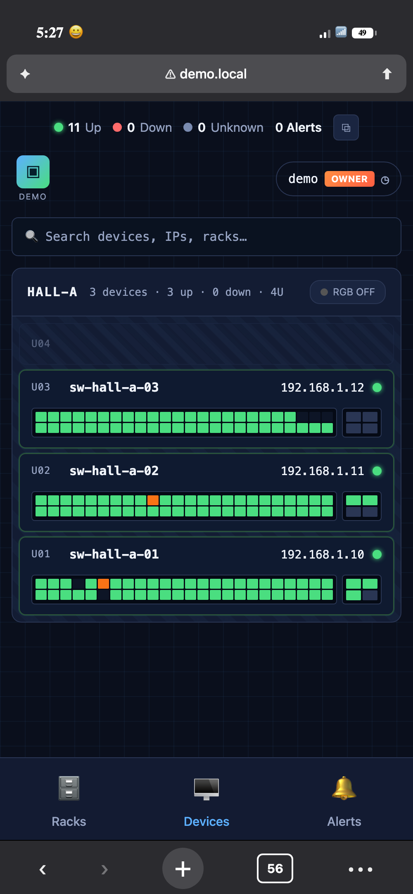

# ECPC-DataCenter — Contest Network Ops Platform

> **Live network monitoring, per-team port mapping, in-browser SSH, and WhatsApp alerting — built and used in production for the Egyptian Collegiate Programming Contest (ECPC).**

A self-hosted operations dashboard that keeps sysops in the loop during a contest with hundreds of teams across multiple halls. Zero external SaaS — everything runs on one on-prem VM.

---

## Screenshots

| Rack view + per-switch port heatmap | Traffic snapshot page |
|---|---|
|  |  |

| Per-team port map (hover) | WhatsApp alert routing |
|---|---|
|  |  |

| In-browser SSH terminal (xterm.js) | Mobile-responsive |
|---|---|
|  |  |

---

## What it does

- **Real-time rack view** — every physical rack, every device, live status
- **48-port switch face** — every port green/red/orange in sync with SNMP
- **100 Mbps link detection** — ports that didn't negotiate 1 Gbps flag orange on the panel
- **Auto-detects switch model** — Cisco Catalyst 2960+24 (24-port FE) and CBS 350-48P (48-port GE) render with the correct face; Cisco IOS classic `ifIndex 10001+` remapping handled server-side
- **Per-team port mapping** — paste team numbers into a switch's Edit dialog; alerts and tooltips instantly show "Team 1045 down" instead of "port 5 on switch 2"
- **On-demand traffic snapshot** — polls RX/TX per port only when someone opens the page; no continuous SNMP load on the contest network
- **In-browser SSH** — xterm.js on the topbar, connects to any switch (yes, even the crusty Cisco 2960 running IOS 15 with legacy KEX algorithms)
- **WhatsApp routing** — each hall has its own WhatsApp group; port/switch down alerts go to the right group with team number, port, switch, timestamp
- **Mute page** — pause WhatsApp without touching the website (separate password, separate port)
- **Drag-to-reorder racks**, **collapsible side panels**, **team-number hover tooltip**, **mobile bottom-tab UI**

## Tech stack

**Backend** (`server.js`) — Node.js standard library only. Zero npm deps. Custom SNMP polling via `net-snmp` CLI, custom WebSocket implementation, session auth with scrypt password hashing.

**Frontend** — vanilla JS + CSS. No framework. Single-page dashboard.

**Bot** — `@whiskeysockets/baileys` (WhatsApp Web protocol), reads the website's `state.json` and routes alerts per hall.

**Terminal** — `xterm.js` frontend + `expect` on the server to drive `ssh` with legacy Cisco crypto options.

**State persistence** — atomic file writes (write `.tmp` → fsync → rename → keep `.bak`) so a mid-write power cut can't corrupt the state file.

## Architecture

```
┌─────────────────┐     SNMP       ┌────────────────────────┐
│ Contest switches├───────────────▶│  Ubuntu VM             │
│ (Cisco, ~30x)   │                │  ┌──────────────────┐  │
└─────────────────┘                │  │ website (port 80)│  │
                                   │  └────────┬─────────┘  │
                                   │           │            │
                                   │      state.json        │
                                   │           │            │
                                   │  ┌────────▼─────────┐  │
                                   │  │ bot (Baileys)    │──┼──▶ WhatsApp
                                   │  └──────────────────┘  │    per-hall groups
                                   └────────────────────────┘
```

## Context

Built for the **Egyptian Collegiate Programming Contest** (ECPC) — Egypt's regional round of the ACM ICPC. During the contest, hundreds of teams compete simultaneously across four physical halls; each team's laptop is plugged into a specific port on a specific switch. When something drops, sysops needs to know **which team, which switch, which port, right now** — not five minutes later after cross-referencing a paper map.

This platform is what runs the contest network ops.

## Status

Actively used in production. Continuously iterated during and between contests based on what sysops actually need in the room.

---

*Source code is in a private repo — happy to walk through it in an interview.*

**Contact:** [github.com/Yassin-Elsaadany](https://github.com/Yassin-Elsaadany)
